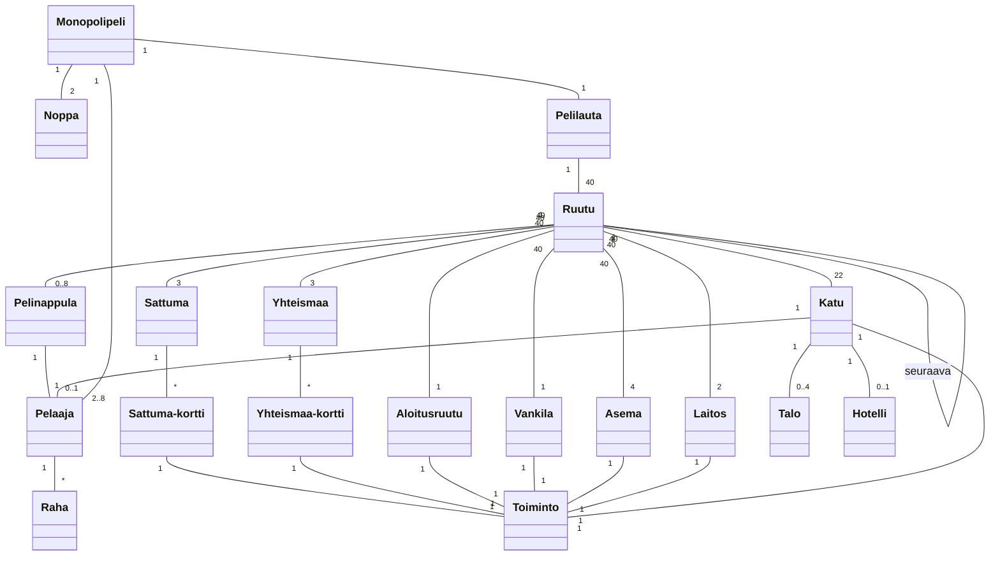

```mermaid
 classDiagram
    Monopolipeli "1" -- "2" Noppa
    Monopolipeli "1" -- "1" Pelilauta
    Pelilauta "1" -- "40" Ruutu
    Ruutu "1" -- "1" Ruutu : seuraava
    Ruutu "1" -- "0..8" Pelinappula
    Pelinappula "1" -- "1" Pelaaja
    Pelaaja "2..8" -- "1" Monopolipeli

   Ruutu "40" -- "1" Aloitusruutu
   Ruutu "40" --  "1" Vankila
   Ruutu "40" --  "3" Sattuma
   Ruutu "40" --  "3" Yhteismaa
   Ruutu "40" --  "4" Asema
   Ruutu "40" --  "2" Laitos
   Ruutu "40" -- "22" Katu

   Sattuma "1" -- "*" Sattuma-kortti
   Yhteismaa "1" -- "*" Yhteismaa-kortti

   Sattuma-kortti "1" -- "1" Toiminto
   Yhteismaa-kortti "1" -- "1" Toiminto

   Aloitusruutu "1" -- "1" Toiminto
   Vankila "1" -- "1" Toiminto
   Asema "1" -- "1" Toiminto
   Laitos "1" -- "1" Toiminto

   Katu "1" -- "1" Toiminto
   Katu "1" -- "0..4" Talo
   Katu "1" -- "0..1" Hotelli
   Katu "1" -- "0..1" Pelaaja
   Pelaaja "1" -- "*" Raha
```
