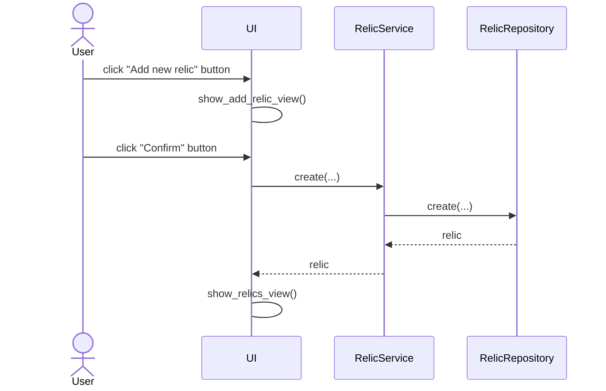

# Architecture

## Structure

The application structure follows the same three layer architecture as the reference app:

```
 ui

 |
 v

services  -----> entities

  |                ^
  v                |
                   |
repositories  -----|
```

where `ui` handles the interface, `services` the application logic, and `repositories` the data storage side. `entities` contains the data structures used by the application.

## Main functionality

### Adding a relic

The software logic progresses as follows once a user enters the Add new relic -page, enters the necessary details, and clicks Confirm:


