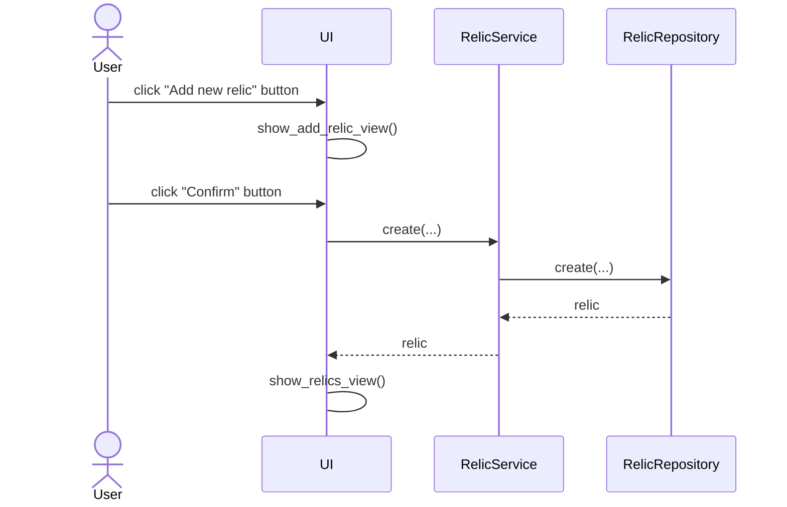

# Architecture

## Structure

The application structure follows the same three layer architecture as the reference app:

```
 ui

 |
 v

services  -----> entities

  |                ^
  v                |
                   |
repositories  -----|
```

where `ui` handles the interface, `services` the application logic, and `repositories` the data storage side. `entities` contains the data structures used by the application.

## User interface

The user interface contains two views:

- Main view
- New relic view

Both views are handled as their own class. Only one view is visible at a time. Showing the views is handled by the UI class.

## Main functionality

### Adding a relic

The software logic progresses as follows once a user enters the Add new relic -page, enters the necessary details, and clicks Confirm:



## Data storage

The `RelicRepository` class follows the repository model and handles saving data into an SQLite database.

### Files

Relics are saved in the `relics` table in an SQLite database, which is stored in the `data` folder. The `.env` file in the root directory determines the name of the database file.
